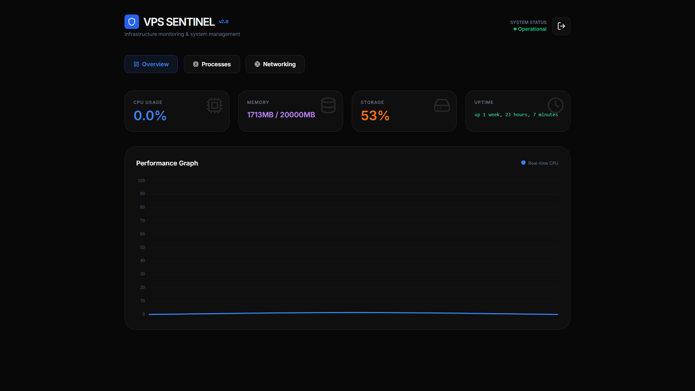

# 🛡️ VPS Sentinel

**VPS Sentinel** is a lightweight, modern, and high-performance system monitoring dashboard built with **Spring Boot 3** and **Tailwind CSS**. It provides a sleek Glassmorphism interface for real-time tracking of CPU, RAM, Disk, System Processes, and Network Ports directly from your VPS.

 
## ✨ Features
- 🚀 **Real-time Monitoring:** Instant tracking of CPU Load, RAM usage, and Disk space.
- 📊 **Live Analytics:** Dynamic CPU performance charts powered by Chart.js.
- ⚙️ **Process Management:** Detailed list of Top 10 resource-heavy processes (PID, CPU%, Mem%).
- 🌐 **Network Security:** View all active listening (LISTEN) ports and network services.
- 🔐 **Secure Access:** Custom-built login system using Spring Security.
- 🐧 **Linux Optimized:** Leverages native Linux commands for 100% data accuracy.

## 🛠️ Tech Stack
- **Backend:** Java 17, Spring Boot 3, Spring Security, Spring Data JPA.
- **Frontend:** Thymeleaf, Tailwind CSS, Lucide Icons, Chart.js.
- **Database:** H2 (In-Memory).

## 🚀 Deployment & Installation

### Prerequisites
- **Java 17** or higher installed on your server.

### Quick Start (Using Release)
1. Download the latest `.jar` file from the **Releases** section.
2. Transfer the file to your VPS.
3. Run the application using the following command:

```bash
# Standard execution
java -jar vps-sentinel.jar

# Run in background (Persistent)
nohup java -jar vps-sentinel.jar > app.log 2>&1 &
````

Once running, access the dashboard at: `http://your-vps-ip:8080`

- **Default Username:** `admin`
- **Default Password:** `admin`

## 📅 Road-map (To-Do List)

- [ ] 🔔 **Alert System:** Telegram/Email notifications for high CPU or Disk usage.
- [ ] 🐳 **Docker Integration:** Monitoring running containers and their stats.
- [ ] 🛠️ **Service Control:** Ability to kill processes directly from the UI.
- [ ] 🌡️ **Hardware Health:** Displaying CPU temperature and fan speeds.
- [ ] 🌑 **Multi-Theme:** Advanced Dark/Light mode customization.

## 🤝 Contributing

Contributions, issues, and feature requests are welcome\! Feel free to check the [issues page](https://www.google.com/search?q=https://github.com/yourusername/vps-sentinel/issues).

-----

Developed with ❤️ by **Amin Madani**
